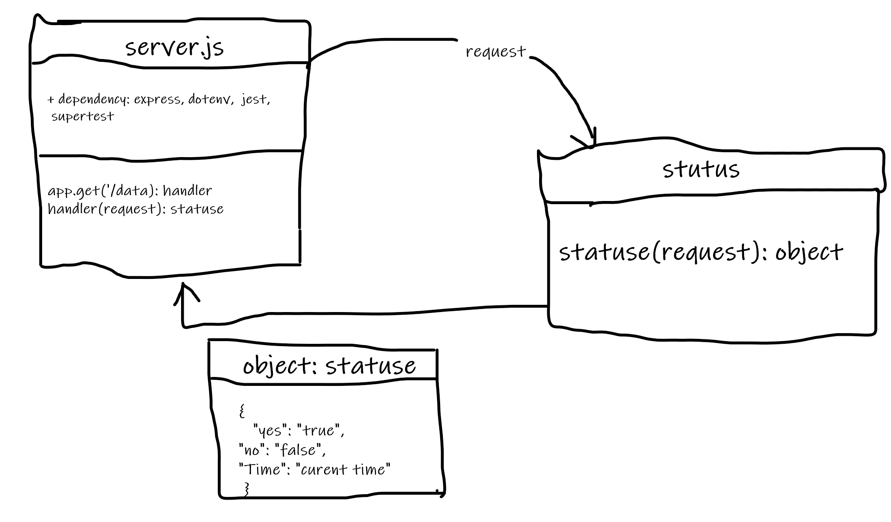

# server-deployment-practice

- instructor notes:

    - instal work flow from Active, and adjust it
    - install all the dependencies
    - test using jest `npm test`

- Heroku links:

  - **dev**:

    - https://omars-server-deploy-dev.herokuapp.com/
    - https://omars-server-deploy-dev.herokuapp.com/data
    - https://omars-server-deploy-dev.herokuapp.com/errorsdd
    - https://omars-server-deploy-dev.herokuapp.com/bad

  - **prod**: 
    - https://omars-server-deploy-prod.herokuapp.com/
    - https://omars-server-deploy-prod.herokuapp.com/data
    - https://omars-server-deploy-prod.herokuapp.com/errorsdd
    - https://omars-server-deploy-prod.herokuapp.com/bad

- UML:
    